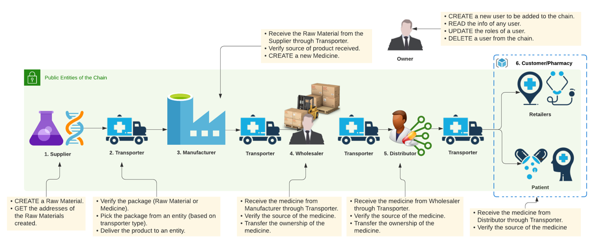
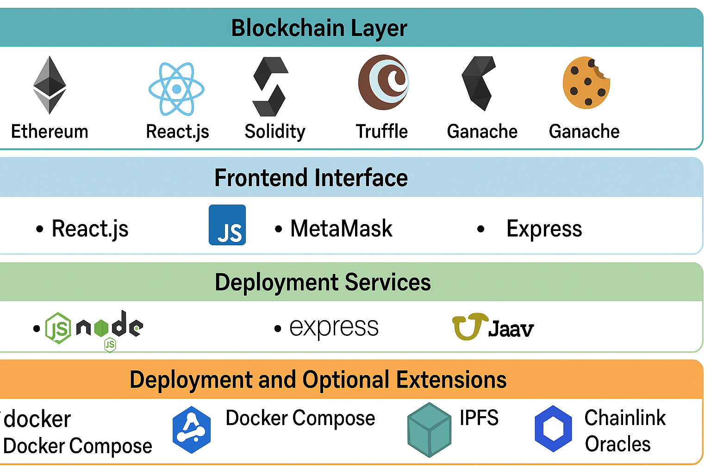
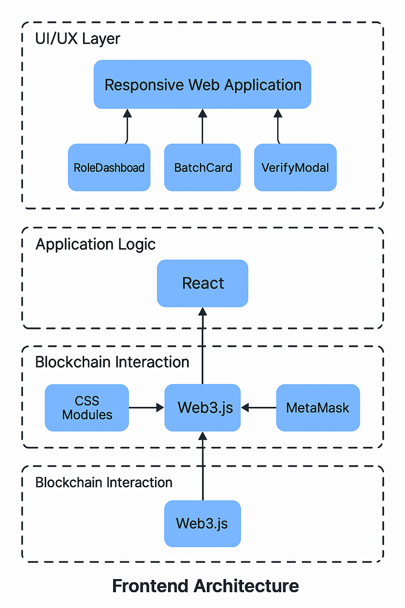
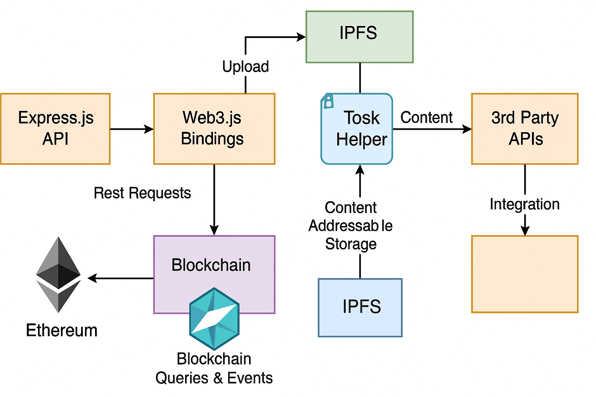
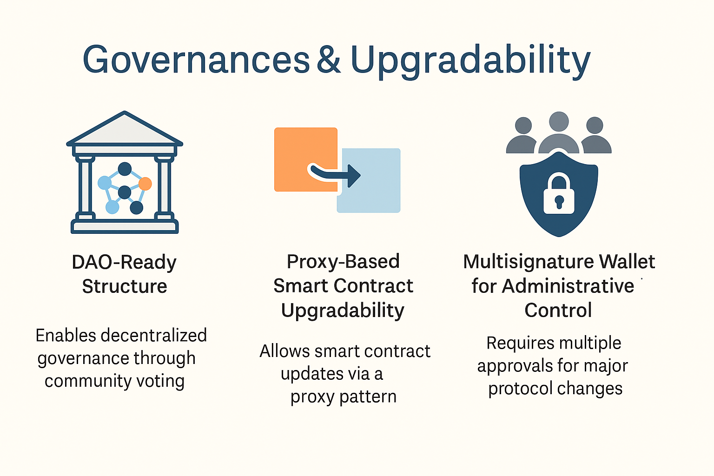

# MediTracker: Blockchain-Based Pharmaceutical Supply Chain System

# 0. Overview


**MediTracker** is a blockchain-based pharmaceutical supply chain management system designed to combat drug counterfeiting, enhance traceability, and improve public health transparency. The platform leverages smart contracts, IPFS, and decentralized identity protocols to enable secure, auditable medicine provenance from suppliers to end consumers.


### Key Resources

Access our core project deliverables below:

### Project Introduction Video

[](https://youtu.be/NTReCgeytXo)  
A brief overview of MediTracker’s mission, core functionality, and how blockchain enables end-to-end pharmaceutical traceability.
### Code Demonstration Video

[](https://youtu.be/06K6Q2mtUoE)  
A detailed walkthrough of the MediTracker codebase, including:

- Smart contract structure and role management in Solidity
- React-based frontend interface (MetaMask integration, dashboard views)
- IPFS integration for off-chain document storage
- Backend API endpoints for batch tracking and event logs
- Live interactions on a local Ethereum testnet via Ganache and Truffle


### Key Resources

**[Final Report (PDF)](./assets/FT5003_Group_Project_Meditracker_Report.pdf)**  
A comprehensive technical report detailing MediTracker’s system design, including smart contract architecture, governance mechanisms, and blockchain-based traceability solutions.

**[Presentation Slides (PDF)](./assets/FT5003_MediTracker_Presenation.pdf)**  
The final showcase presentation highlighting project motivation, architecture, features, and implementation strategy.

**[Source Code (GitHub)](https://github.com/wilbur20074925d/MediTracker.git)**  
Complete source code repository containing Solidity smart contracts, a React.js frontend, an Express.js backend, and Docker deployment configuration.

**[Visit the Project Webpage](https://20074925d.wixsite.com/meditracker/home)**  
Public-facing website offering an overview of the MediTracker platform, its features, and project team, with visual demonstrations and contextual information.

> **Note:** Click on each resource link to open or download the corresponding file. PDF previews and embedded video content are not supported directly in GitHub `README.md` rendering.


### Team Members

- YANG Yuebo
- WANG Xinyu
- ZOU Yiran
- ZHOU Yuran
- FENG Moyuan
- SUI He
- WANG Yongzhi

### Supervisor

**Dr. Nicholas Mac Gregor Garcia**  
[Profile @ NUS School of Computing](https://www.comp.nus.edu.sg/disa/people/ngarcia/)

---

This overview introduces the mission and scope of the project while providing a professional landing point for readers to access both technical and contextual materials.


## 1. Introduction

> “The greatest threat to global health is not disease—it’s the circulation of counterfeit medicine.”  
> — World Health Organization (paraphrased)

The pharmaceutical industry is under increasing pressure to safeguard the integrity of its supply chains. Counterfeit drugs, estimated to account for over 10% of all medicines globally, not only undermine patient safety but also erode trust in healthcare systems. These fake pharmaceuticals often infiltrate the distribution network through opaque intermediaries, unregulated channels, and unverifiable sourcing practices.

Traditional centralized tracking systems are insufficient—they lack real-time visibility, are vulnerable to manipulation, and cannot guarantee data immutability. As a result, manufacturers, healthcare providers, regulators, and patients are left with limited tools to verify the authenticity and origin of the medicines they produce, distribute, or consume.

**MediTracker** addresses these challenges by offering a decentralized, blockchain-powered pharmaceutical traceability platform. Built on the Ethereum network, MediTracker logs every significant event—such as raw material creation, medicine manufacturing, shipment, and delivery—onto an immutable, publicly verifiable ledger. By integrating smart contracts, role-based access control, and off-chain document storage, the platform ensures transparency, auditability, and regulatory compliance across all layers of the supply chain.

The platform benefits a wide range of stakeholders:
- **Manufacturers** gain verifiable control over production data.
- **Transporters and wholesalers** receive tamper-proof handoff records.
- **Regulators** have access to real-time audits and non-repudiable logs.
- **Consumers** can verify product authenticity with a single QR scan.

### System Architecture Diagram

Below is a high-level architecture diagram illustrating the flow of pharmaceutical data and interactions across MediTracker’s on-chain and off-chain components:




---


## 2. Features

MediTracker offers a robust set of features designed to enhance transparency, security, and regulatory compliance across the pharmaceutical supply chain. The system combines blockchain immutability with modern web technologies to deliver a scalable, auditable, and user-friendly solution. Key features include:

- **Role-Based Access Control (RBAC)**  
  Fine-grained permissions are enforced at the smart contract level, allowing only authorized entities—such as Owners, Suppliers, Manufacturers, Transporters, Wholesalers, Distributors, and Pharmacies—to perform specific actions. This ensures accountability and minimizes the risk of unauthorized data manipulation.

- **Ethereum Smart Contract Governance**  
  All critical operations, including registration, production, shipment, and verification of pharmaceutical goods, are governed by tamper-proof Ethereum smart contracts. These contracts execute logic autonomously, ensuring trustless cooperation between stakeholders.

- **Event-Based Lifecycle Logging**  
  Each significant action in a package’s lifecycle—creation, shipment, delivery, and verification—is recorded on-chain through Solidity event emissions. These events provide an immutable audit trail accessible to regulators and auditors at any time.

- **QR Code-Based Verification**  
  Each medicine package is linked to a unique, scannable QR code. Consumers and healthcare professionals can scan the code to instantly verify the product’s origin, authenticity, and complete transaction history via a blockchain lookup.

- **IPFS-Backed Document Anchoring**  
  Supporting documents such as lab certificates, compliance proofs, and batch reports can be uploaded to IPFS (InterPlanetary File System). The corresponding content hashes are stored on-chain, ensuring verifiability without bloating the blockchain.

- **Hybrid Data Architecture**  
  To maintain scalability, MediTracker uses a hybrid approach where large or sensitive data is stored off-chain, while cryptographic proofs and hash references are stored on-chain. This guarantees both efficiency and integrity.

These features collectively create a trustless, transparent, and auditable ecosystem that significantly reduces the risk of pharmaceutical fraud and supports global supply chain compliance.

## 3. Technologies Used

MediTracker leverages a modern, modular technology stack to ensure security, scalability, and seamless user interaction across all supply chain participants. Each component is selected for its reliability in decentralized application (dApp) development and compatibility with blockchain-based systems.

### Blockchain Layer
- **Ethereum**: Serves as the foundational decentralized network for executing smart contracts and storing immutable transaction data.
- **Solidity**: The primary programming language used to develop the MediTracker smart contracts, including role management and supply chain workflows.
- **Truffle**: A development framework for compiling, migrating, and testing Solidity contracts in a structured and reproducible manner.
- **Ganache**: A personal Ethereum blockchain for rapid local development and testing, offering deterministic transactions and detailed debugging.

### Frontend Interface
- **React.js**: Builds a responsive, component-based single-page application (SPA) that dynamically adapts to the user’s role in the supply chain (e.g., Supplier, Manufacturer, Regulator).
- **Web3.js**: Interfaces with the deployed Ethereum smart contracts, enabling the frontend to sign transactions, call functions, and listen for events using the browser’s Ethereum provider.
- **MetaMask**: A browser wallet extension used for key management and Ethereum account authentication. Users must authorize each transaction with their wallet.

### Backend Services
- **Node.js**: Powers the server-side logic, including RESTful API routes and transaction logging.
- **Express.js**: A lightweight HTTP server that provides endpoints for package tracking, IPFS hash verification, and integration with external systems (e.g., regulatory APIs).

### Deployment and Containerization
- **Docker**: Containers isolate and standardize the development environment, ensuring consistent builds across teams and machines.
- **Docker Compose**: Orchestrates the multi-container setup (Ganache, Backend, Frontend), simplifying local development and CI/CD pipelines.

### Optional Extensions
- **IPFS (InterPlanetary File System)**: Used for storing large or sensitive documents such as compliance reports and lab results off-chain. The content-addressed hashes are stored on-chain for integrity checks.
- **Chainlink Oracles**: Can be integrated to fetch external data—such as shipment status or environmental sensors—into smart contracts, enabling real-world awareness in on-chain logic.

---

This technology stack enables MediTracker to operate as a secure, traceable, and extensible platform across physical and digital layers of pharmaceutical logistics.




### Component Descriptions

- **`/contracts/`**  
  Contains all Solidity smart contracts that govern the MediTracker system, including:
  - `SupplyChain.sol`: Registers and verifies roles.
  - `RawMaterial.sol`: Tracks raw material creation.
  - `Medicine.sol`: Tracks medicine production.
  - `TransactionRaw.sol` & `TransactionMedicine.sol`: Handle logistics and batch movement.

- **`/frontend/`**  
  A single-page application built with React.js. It supports:
  - MetaMask wallet authentication.
  - Web3.js interactions with deployed contracts.
  - Role-based dashboard rendering and QR-based verification.

- **`/backend/`**  
  Implements a Node.js + Express server that:
  - Offers RESTful API endpoints for batch lookup and traceability.
  - Interfaces with Web3.js for event parsing.
  - Optionally integrates with IPFS or Chainlink Oracles.

- **`/migrations/`**  
  Truffle-managed deployment scripts that:
  - Compile and deploy contracts to Ganache or testnet.
  - Maintain deployment order and state across networks.

- **`/test/`**  
  Contains automated tests written in Mocha and Chai that:
  - Validate smart contract logic.
  - Simulate role interactions.
  - Ensure system invariants (e.g., only manufacturers can mint medicine).

- **`docker-compose.yml`**  
  Defines a local development environment with three core containers:
  - Ganache (Ethereum node),
  - Backend API,
  - Frontend UI.
  Allows contributors to spin up the entire stack with a single command.

- **`truffle-config.js`**  
  Configuration file for Truffle that manages:
  - Compiler version,
  - Network settings (e.g., Ganache, Ropsten),
  - Custom deployment parameters.

This structure promotes modularity, reproducibility, and ease of collaboration across both blockchain developers and full-stack engineers.

## 5. Smart Contract Overview

MediTracker is architected using a suite of modular and role-specific Solidity smart contracts, each corresponding to a defined entity or function in the pharmaceutical supply chain. These contracts implement business logic, enforce access control, and emit verifiable events for every transaction, creating an auditable and tamper-proof history.

### `/contracts/` Directory

| Contract File             | Description |
|--------------------------|-------------|
| `SupplyChain.sol`        | The central registry for all entities in the system. It manages role assignment, identity verification, and overall governance through modifiers like `onlyOwner`, `onlyRole(...)`. |
| `RawMaterial.sol`        | Allows verified suppliers to create raw material batches. Links each batch with its origin, metadata, and document hash stored off-chain (e.g., IPFS). |
| `Medicine.sol`           | Used by manufacturers to mint verified medicine batches based on approved raw materials. Connects each product to a traceable lifecycle. |
| `Transactions.sol`       | Handles the recording and updating of transactional states (e.g., `Created`, `InTransit`, `Delivered`) for both raw and finished goods across entities. |
| `Customer.sol`           | Defines interactions available to customers/pharmacies, such as verifying product authenticity or scanning QR codes for batch history. |
| `Supplier.sol`           | Manages supplier-specific actions such as raw material creation, document linkage, and shipment to manufacturers. |
| `Manufacturer.sol`       | Governs manufacturer permissions, including receiving raw materials, initiating medicine production, and dispatching to wholesalers. |
| `Transporter.sol`        | Assigns package pickup/delivery rights and logs geographic or temporal proof-of-transfer for logistics auditing. |
| `Wholesaler.sol`         | Supports wholesaler-side operations for accepting and redistributing medicine from manufacturers to distributors. |
| `Distributor.sol`        | Final intermediary role before customer/pharmacy access. Handles inbound receipt and outgoing delivery of medicine. |
| `MedicineD_C.sol`        | Optional extension for Distributor-to-Customer delivery flow. Handles direct-to-consumer dispatch validation and receipt confirmation. |
| `MedicineW_D.sol`        | Optional extension for Wholesaler-to-Distributor handoffs. Helps distinguish institutional versus retail logistics. |
| `Testing.sol`            | Internal sandbox contract for testing critical state transitions, modifiers, and batch edge cases during QA. |
| `SupplyChainTest.sol`    | Test harness for validating `SupplyChain.sol` role assignment, ownership, and permission propagation. |
| `Migrations.sol`         | Standard Truffle migration contract required to bootstrap and register deployed contract addresses on-chain. |

### Design Principles

- **Modularity**: Each contract maps to a specific supply chain role or operation. This separation of concerns improves code clarity, testability, and upgrade paths.
- **RBAC Enforcement**: Access to functions is gated using modifiers tied to role identity, ensuring that only the correct entity type can invoke state-altering functions.
- **Event Logging**: Every material or medicine action triggers blockchain events such as `RawMaterialCreated`, `MedicineDispatched`, or `OwnershipTransferred`, which are parsed and rendered in the frontend.
- **Composability**: Contracts are linked via inheritance and function calls, enabling dynamic workflow composition while maintaining security boundaries.

---

All contracts are written in **Solidity v0.8.x** and conform to security best practices such as overflow protections, reentrancy guards (where applicable), and centralized ownership recovery via `Ownable`.

View the full contract code in the GitHub repo:  
[https://github.com/wilbur20074925d/MediTracker.git](https://github.com/wilbur20074925d/MediTracker.git)

## 6. Frontend

The MediTracker frontend is a responsive, single-page web application (SPA) built using **React.js**. It provides a clean and role-sensitive interface for all supply chain participants—Suppliers, Manufacturers, Transporters, Wholesalers, Distributors, and Customers—to interact with the Ethereum smart contracts via **Web3.js** and **MetaMask**.

### MetaMask Authentication
Users authenticate using MetaMask, which acts as a browser-based Ethereum wallet. Upon login, the application requests the user’s account address and cryptographic signature to verify identity and connect with the appropriate smart contract functions. Transactions are confirmed by the user within MetaMask before being broadcast to the Ethereum network.

### Role-Based Dashboards

MediTracker delivers a dynamic and secure user experience by rendering dashboards that adapt based on the authenticated user's role. Each user's role is determined on-chain through queries to the `SupplyChain.sol` contract, which validates registration and permissions before allowing access to application features.

Each role corresponds to a distinct set of responsibilities and interface components:

- **Supplier Dashboard**  
  Enables registered suppliers to create and register raw material batches. Inputs include batch metadata, origin details, and optional IPFS document hashes for certification or compliance.

- **Manufacturer Dashboard**  
  Provides manufacturers with functionality to receive verified raw materials, initiate medicine production workflows, and register new medicine batches. The dashboard displays batch lineage and associated events.

- **Transporter Dashboard**  
  Allows transporters to confirm dispatch and receipt of packages. Transport events are linked to timestamps and geolocations, and every delivery is recorded immutably on-chain.

- **Wholesaler and Distributor Dashboards**  
  These dashboards support the handoff and receipt of pharmaceutical goods between intermediate supply chain entities. Users can view incoming and outgoing batch statuses, confirm receipts, and forward inventory to the next destination.

- **Customer Dashboard**  
  Designed for pharmacists and end-users, the customer dashboard offers a simple interface to scan QR codes, verify medicine authenticity, and view the public transaction history of a specific batch.

Access control is strictly enforced. Users are only able to perform actions and view data relevant to their assigned roles, ensuring system integrity, traceability, and minimal exposure of sensitive operations.

### Real-Time Blockchain Event Listeners

To ensure transparency and immediate feedback across the supply chain, the MediTracker frontend implements real-time blockchain event listeners using **Web3.js**. These listeners subscribe to smart contract event logs emitted on the Ethereum network, enabling the application to react instantly to on-chain state changes.

Key emitted events include (but are not limited to):

- `RawMaterialCreated`: Triggered when a supplier successfully registers a new raw material batch.
- `MedicineDispatched`: Emitted when a manufacturer transfers a verified medicine batch to a wholesaler or distributor.
- `PackageDelivered`: Logged when a transporter confirms the final delivery of a batch to its intended recipient.
- `OwnershipTransferred`: Captures any change in custodial ownership across roles.
- `BatchVerified`: Emitted when a consumer successfully verifies the integrity of a medicine package via QR code.

These events are captured using Web3.js’s `contract.events.<EventName>()` interface, which listens for logs on the latest blocks and pushes them to the frontend UI. Each event is decoded, timestamped, and linked to the corresponding dashboard view, ensuring that users can:

- Monitor status updates without refreshing the page.
- Receive push notifications or UI toasts when an event of interest occurs.
- Validate that their own transaction has been mined and confirmed on-chain.

This event-driven architecture improves responsiveness, supports real-time traceability, and enhances user confidence in the integrity of the pharmaceutical tracking system.

### Notification System

To improve user experience and ensure transparency during blockchain interactions, the MediTracker frontend includes a responsive, toast-based notification system. This system provides real-time feedback on the status of blockchain transactions and user-triggered operations, helping users understand what is happening behind the scenes and reducing uncertainty during critical interactions.

The notification system handles and categorizes feedback into the following types:

- **Pending Transactions**  
  When a user initiates an action that requires MetaMask approval—such as registering a batch or dispatching a shipment—the UI displays a non-intrusive notification indicating that the transaction is awaiting signature or blockchain confirmation.

- **Success Confirmations**  
  Upon successful mining and confirmation of a transaction, a success toast is shown with contextual details (e.g., "Raw material batch successfully created"). The notification includes a link to a block explorer (e.g., Etherscan or Ganache) for verification.

- **Error Handling and Reverts**  
  If a transaction fails due to issues such as insufficient gas, role-based permission denial, or smart contract reverts, the user is immediately notified with a clear and human-readable error message. This enables faster troubleshooting and avoids user confusion.

Each notification is time-bound, role-aware, and non-blocking, ensuring that critical feedback is always visible without disrupting user workflows. The system is implemented using lightweight React toast libraries and is fully extensible for future use cases (e.g., transaction retries, gas estimation feedback).

### UI/UX Design

The MediTracker frontend is built with a strong emphasis on usability, accessibility, and scalability. Designed as a single-page application using React, the interface is crafted to deliver a seamless experience across different user roles and device types while abstracting the technical complexities of blockchain interaction.

Key UI/UX principles and implementation features include:

- **Responsive Layout**  
  The application follows a mobile-first design philosophy, ensuring consistent usability across desktops, tablets, and mobile browsers. The layout dynamically adapts to screen sizes using flexible CSS grid and media queries.

- **Modular Component Architecture**  
  The frontend is composed of reusable and maintainable React components such as:
  - `RoleDashboard`: Renders contextual UI based on the authenticated user's role.
  - `BatchCard`: Displays metadata, status, and transaction history for a batch.
  - `VerifyModal`: Provides a pop-up interface for QR-based batch verification and feedback.
  
  This modular design pattern promotes consistency, simplifies testing, and accelerates development.

- **Modern Styling Frameworks**  
  Components are styled using scoped CSS modules to avoid style collisions. Optionally, utility-first frameworks like **Tailwind CSS** or responsive libraries like **Bootstrap 5** can be integrated to further accelerate UI development and ensure a visually coherent interface.

- **Accessibility and UX Enhancements**  
  - Tab navigation and ARIA attributes are supported to improve screen reader compatibility.
  - Action feedback such as button states, loading indicators, and toast notifications are integrated to reinforce interaction outcomes.
  - Form validation and error handling follow consistent patterns to reduce user confusion.

The UI/UX layer of MediTracker is designed to offer clarity, trust, and ease of use—especially important for non-technical stakeholders such as pharmacists and regulators interacting with blockchain for the first time.

---

Together, these frontend features ensure a user-friendly yet trustless interface, abstracting the complexity of Ethereum while empowering participants with transparency and control.



## 7. Backend

The backend layer of MediTracker serves as the middleware between the blockchain smart contracts and the frontend user interface. Built with **Node.js** and **Express.js**, the backend is responsible for exposing RESTful APIs, processing blockchain events, managing off-chain data interactions, and enabling external system integration.

### Key Functional Components

- **Express REST API**  
  The backend exposes secure, versioned REST endpoints (e.g., `/api/batches`, `/api/verify`, `/api/history/:batchId`) that power frontend features such as batch tracking, status retrieval, and ownership history. Role-based access middleware ensures API calls are only fulfilled for verified MetaMask-authenticated users.

- **Web3.js Contract Bindings**  
  The backend uses **Web3.js** to interact with deployed Ethereum smart contracts. It handles:
  - Read-only calls (e.g., fetching batch data, role queries)
  - Subscribing to event logs (e.g., `RawMaterialCreated`, `MedicineDispatched`)
  - Decoding and indexing blockchain data for display in the frontend

- **IPFS Integration (Optional)**  
  For documents that are too large or sensitive to store on-chain, such as laboratory certifications or regulatory compliance forms, the backend provides a helper module to:
  - Upload files to IPFS nodes
  - Return the resulting content hash
  - Link the hash to a smart contract record for future verification

- **Batch Data Aggregation**  
  The backend supports enriched data processing by aggregating event logs and cross-referencing contract states. This allows it to serve comprehensive batch timelines that include origin, transfer history, verification events, and current status.

- **Third-Party API Integration**  
  The system is designed to optionally integrate with external services, including:
  - **Chainlink Oracles**: For injecting off-chain data into smart contracts (e.g., GPS signals, shipment temperatures, price feeds)
  - **Regulatory Databases**: To cross-check registered facilities or compliance certificates
  - **Analytics Tools**: For backend logging, user activity monitoring, and performance insights

### Architecture Highlights

- Built on **Express.js** with modular routing and controller layers
- Connected to the Ethereum blockchain via a Web3 provider (e.g., Infura or Ganache)
- Designed to support deployment in both containerized (Docker) and serverless environments
- Can be extended with WebSockets for pushing real-time updates to the frontend

The backend is essential to MediTracker’s ability to combine the auditability of blockchain with the flexibility of web APIs—creating a bridge between smart contract logic and real-world application use cases.



## 8. Installation & Setup

This section provides a step-by-step guide to setting up the MediTracker platform in your local development environment.

### Prerequisites

Ensure the following tools are installed on your machine:

- **Node.js v16+**
- **npm** or **yarn**
- **Truffle** (`npm install -g truffle`)
- **Ganache CLI** (`npm install -g ganache-cli`)
- **Docker** and **Docker Compose** (optional but recommended)

Check versions with:

```bash
node -v
truffle version
ganache-cli --version
```

---

### Quickstart

1. **Clone the Repository**

```bash
git clone https://github.com/your-org/meditracker.git
cd meditracker
```

2. **Install Dependencies**

```bash
npm install           # Install root-level dependencies
cd frontend && npm install
cd ../backend && npm install
```

3. **Start Ganache CLI**

```bash
ganache-cli -p 7545 --mnemonic "candy maple cake sugar pudding cream honey rich smooth crumble sweet treat"
```

4. **Deploy Smart Contracts**

```bash
cd ..
truffle migrate --reset --network development
```

5. **Run Backend Server**

```bash
cd backend
npm start
```

6. **Run Frontend**

```bash
cd ../frontend
npm run dev
```

7. **Access the App**

Open your browser and go to:

```
http://localhost:3000
```

---

### Optional: Run via Docker

If you prefer containerization, launch the stack using Docker Compose:

```bash
docker-compose up --build
```

This will automatically:
- Start Ganache on port `7545`
- Launch the backend on port `4000`
- Serve the frontend at `http://localhost:3000`

---

### Troubleshooting

- Ensure MetaMask is connected to `http://localhost:7545`
- If contract migrations fail, try `truffle compile --all` then re-run `migrate`
- Delete the `build/` folder if encountering ABI versioning issues

---

This setup ensures a clean, reproducible environment for development, testing, and smart contract interaction.


## 9. API Endpoints

MediTracker exposes a RESTful API built with Express.js to allow the frontend and third-party systems to interact with the blockchain-backed pharmaceutical data. These endpoints retrieve and verify information about raw material and medicine batches, emit transaction logs, and perform on-chain/off-chain data coordination.

All endpoints are prefixed under:  
http://localhost:4000/api/

---

### GET /api/batch/:id

**Purpose**:  
Fetches full metadata for a batch using its on-chain ID (either raw material or medicine batch).

**Request Parameters**:
- `:id` – Batch ID (generated by smart contracts)

**Response**:
```json
{
  "batchId": "RM-002",
  "type": "RawMaterial",
  "status": "Delivered",
  "createdAt": "2025-04-22T10:45:00Z",
  "manufacturer": "0xAbcd...",
  "ipfsHash": "Qmabc123...",
  "history": [
    { "event": "Created", "timestamp": "..." },
    { "event": "Shipped", "timestamp": "..." }
  ]
}
```

---

### POST /api/verify-hash

**Purpose**:  
Verifies that an IPFS hash or batch metadata hash matches the on-chain record.

**Request Body**:
```json
{
  "batchId": "MD-115",
  "submittedHash": "Qmabc123..."
}
```

**Response**:
```json
{
  "verified": true,
  "message": "IPFS hash matches the on-chain record."
}
```

---

### GET /api/history/:batchId

**Purpose**:  
Retrieves the complete transfer and verification history of a given batch by decoding smart contract events.

**Request Parameters**:
- `:batchId` – Unique on-chain identifier

**Response**:
```json
[
  {
    "event": "MedicineDispatched",
    "from": "0xManufacturer...",
    "to": "0xWholesaler...",
    "timestamp": "2025-04-23T13:12:40Z"
  },
  {
    "event": "PackageDelivered",
    "to": "0xPharmacy...",
    "timestamp": "2025-04-24T08:17:05Z"
  }
]
```

---

### Additional Notes

- All requests return data in **JSON format**.
- Authorization may be enforced in production using **MetaMask-based JWTs** or API keys.
- The backend uses **Web3.js** to decode blockchain events and fetch on-chain state for enhanced accuracy.
- IPFS hashes are verified using SHA-256 checksum logic against content-addressed values stored on-chain.

---

### Upcoming Endpoints (Planned)

| Endpoint                       | Description |
|-------------------------------|-------------|
| POST /api/dispatch            | Create a new shipment transaction |
| GET /api/batch/status/:id     | Poll batch state transitions (for dashboard refresh) |
| POST /api/upload-document     | Upload supporting documentation to IPFS and return hash |
| GET /api/ipfs/:hash           | Resolve and preview IPFS-stored documents |

---

This modular API structure provides a clean interface for blockchain integration without exposing the complexity of smart contract internals, supporting real-time traceability, cross-platform access, and potential mobile applications.


## 10. Testing

Comprehensive testing is critical to ensuring the reliability and security of the MediTracker platform. The project supports modular testing across the smart contract layer, backend API, and frontend components.

---

### Smart Contract Testing

Smart contracts are tested using the **Truffle Framework**, which supports automated test execution in JavaScript or Solidity.

#### How to Run:

```bash
truffle test
```

#### Coverage Includes:
- **Access Control Enforcement**  
  Verifies that only authorized roles (e.g., Supplier, Manufacturer) can perform specific actions.
  
- **Package Lifecycle Transitions**  
  Tests the creation, dispatch, delivery, and verification flow of raw materials and medicine batches across roles.
  
- **Ownership and Role Integrity**  
  Ensures role assignment and ownership transfers are enforced correctly and state consistency is maintained.

#### Additional Notes:
- Tests are located in the `/test/` directory.
- Custom accounts are configured to simulate multi-role interactions.
- Events such as `RawMaterialCreated`, `OwnershipTransferred`, and `PackageDelivered` are also asserted.

---

### Frontend Testing

The frontend is tested using **React Testing Library** for component-level logic and **Jest** for assertions and mocking.

#### Key Test Areas:
- **Role-Based Dashboard Rendering**
- **Form Interactions and QR Code Input**
- **MetaMask Login Prompts**
- **Event-Driven UI Feedback (e.g., toasts)**

To run frontend tests:

```bash
cd frontend
npm test
```

---

### Backend Testing

Backend endpoints are validated using **Jest** and optionally via **Postman** for manual integration tests.

#### Scope:
- **API Contract Tests**  
  Confirm that routes like `/api/batch/:id` return expected structure and status codes.
  
- **Web3.js Event Parsing**  
  Unit tests ensure smart contract event logs are accurately parsed and mapped.

- **Error Handling**  
  Includes test cases for malformed requests, unauthorized access, and missing blockchain data.

To run backend tests:

```bash
cd backend
npm test
```

---

### Testing Strategy Summary

| Layer           | Tools Used               | Coverage                     |
|----------------|--------------------------|------------------------------|
| Smart Contracts | Truffle, Mocha, Chai     | Role logic, batch flow       |
| Backend         | Jest, Postman            | API routes, blockchain sync  |
| Frontend        | React Testing Library    | UI logic, event handling     |

This multi-layer testing approach ensures that each module of the MediTracker platform functions correctly in isolation and in coordination with others.


## 11. UX/UI Design

The MediTracker frontend is thoughtfully designed to deliver an intuitive, responsive, and accessible user experience across a diverse set of stakeholders—ranging from supply chain professionals to pharmacists and end-consumers. The design prioritizes ease of navigation, role-specific functionality, and real-time feedback to enhance trust and usability in a blockchain-backed system.

### Responsive Layout

The interface is fully responsive and optimized for:
- Desktop browsers
- Tablets (landscape and portrait)
- Mobile devices

Media queries and grid-based CSS ensure that all interactive elements—such as action buttons, QR scanner, and dashboards—are appropriately scaled and accessible on any screen size.

### Visual Feedback with Semantic Color Coding

To provide immediate status recognition, the UI uses consistent color schemes to denote batch states:
- Green: Successfully delivered
- Blue: In transit
- Yellow: Awaiting dispatch
- Red: Delivery failed or verification error

These visual cues help users quickly assess the condition of a medicine package or shipment without needing to parse logs or technical details.

### Transaction Feedback Modals

Critical user actions, such as:
- Submitting a new batch
- Confirming delivery
- Verifying QR codes

are accompanied by modal dialogs that provide:
- Context-aware instructions
- Real-time MetaMask interaction status
- Success or error summaries upon transaction completion

This reduces ambiguity and supports less technical users in executing blockchain-based operations confidently.

### Dark Mode Support

A built-in dark mode option improves accessibility and visual comfort, especially in low-light conditions. It also aligns with UI standards for modern enterprise and compliance-oriented applications.

---

These UI/UX practices ensure that MediTracker is not only technically robust but also usable, inclusive, and visually clear—key to driving adoption in the healthcare and logistics sectors.

## 12. Monitoring & Observability

Monitoring and observability are critical to the operational integrity of a decentralized system like MediTracker, where transparency, traceability, and user trust are paramount. The platform implements a multi-layered approach to capture and surface transaction flow, system state, and blockchain events in real time.

### Web3 Event Watchers

The backend and frontend both use **Web3.js** event subscriptions to monitor contract-level events emitted on the Ethereum blockchain. Key features include:

- Subscribing to critical smart contract events such as `RawMaterialCreated`, `MedicineDispatched`, `PackageDelivered`, and `OwnershipTransferred`.
- Listening to `logs` via the Ethereum JSON-RPC or WebSocket provider.
- Real-time delivery of updates to frontend users and backend aggregators.

These listeners ensure near-instant awareness of on-chain activity without requiring manual polling.

### Transaction Log and Audit Trail

- Every blockchain transaction initiated through the frontend is logged by its unique `txHash`.
- Contract execution results (e.g., receipt status, gas usage, block number) are captured and stored either temporarily in memory or optionally persisted in a logging service.
- Events are decoded and linked to user-friendly descriptions, forming the foundation of a transparent audit trail.

This enables:
- Back-office review of activity
- Real-time dashboard updates
- Forensics for dispute resolution or regulatory compliance

### Frontend Transaction Feedback

The frontend integrates lightweight, event-driven monitoring and feedback tools:
- **`txHash` Notification**: Shown immediately after a transaction is signed via MetaMask.
- **`receipt` Confirmation**: Displayed upon successful mining and block confirmation.
- **Error Feedback**: Human-readable error descriptions in case of revert, insufficient gas, or permission errors.

These frontend mechanisms ensure users are never left in the dark about the state of their interactions, increasing trust in the blockchain system.

### Developer Observability (Optional Extensions)

The system can be extended with:
- Logging to platforms like **Loggly**, **Datadog**, or **Winston**-based custom logging
- Web3 event archives for replay/debug purposes
- Integration with Prometheus/Grafana for API uptime monitoring

---

Together, these observability features support both end-user experience and developer/operator maintenance, enabling MediTracker to scale while remaining transparent and trustworthy.

## 13. Security Considerations

Security is a foundational pillar of MediTracker, as it operates within a high-stakes domain involving healthcare, pharmaceuticals, and public data transparency. The system incorporates best practices at every level of the stack—smart contract, API, frontend, and data storage—to prevent abuse, ensure data integrity, and protect users.

### Role-Based Access Control (RBAC) via Solidity Modifiers

All smart contracts enforce strict access control using role-specific modifiers, such as `onlySupplier`, `onlyManufacturer`, and `onlyTransporter`. These checks prevent unauthorized actions such as:

- Non-suppliers attempting to create raw material batches
- Distributors accessing manufacturer-only functions
- Users invoking functions out of workflow order

Roles are validated against `SupplyChain.sol`, which acts as the on-chain authority for permission verification.

### MetaMask Signature Validation

Every user-initiated transaction must be cryptographically signed using MetaMask. This serves two security purposes:

- **Authentication**: Ensures that only the wallet owner can submit transactions on behalf of an address.
- **Non-repudiation**: All actions are permanently tied to a public Ethereum address, creating a tamper-proof audit trail.

Additionally, frontend-side Web3.js integration confirms user identity through message signing during login and interaction sessions.

### Frontend Input Sanitization

To prevent injection attacks and ensure safe user interactions:

- All user inputs (e.g., batch metadata, search queries, QR scan values) are sanitized on the frontend using input validation libraries and encoding techniques.
- Form inputs are strictly typed and validated before being transmitted to smart contracts or backend APIs.

This prevents:
- Cross-site scripting (XSS)
- Malformed data corrupting contract states
- UI crashes due to unescaped values

### IPFS Hash Matching & Integrity Verification

When supporting documents (e.g., certificates, compliance records) are uploaded to IPFS, the resulting **content hash** is stored on-chain. Upon retrieval, the hash is matched against the stored value using SHA-256 checks.

This mechanism ensures:
- File authenticity: Files cannot be modified post-upload without detection.
- Off-chain data integrity: Users and regulators can verify that retrieved files are identical to the originals registered on-chain.

---

### Summary

| Layer         | Protection Measures                             |
|---------------|--------------------------------------------------|
| Smart Contracts | Role-based modifiers, overflow checks           |
| Frontend        | Input sanitization, typed forms, secure dialogs |
| Blockchain UX   | Signature verification, MetaMask gating         |
| Off-chain       | IPFS integrity via hash comparison              |

These layered defenses enable MediTracker to operate safely and securely in a decentralized, adversarial environment while maintaining user trust and regulatory compliance.

## 14. Scalability Plan

MediTracker is designed with extensibility and performance in mind to ensure long-term viability across increasing transaction volumes, larger datasets, and broader international adoption. The scalability plan encompasses both on-chain and off-chain strategies, along with future upgrades to take advantage of emerging blockchain infrastructure.

### Off-Chain Data Storage

To reduce gas costs and keep the Ethereum network load minimal, MediTracker separates large or non-essential data from core contract logic:

- Only essential identifiers (batch IDs, content hashes, state transitions) are stored on-chain.
- Supporting documents such as certifications, lab reports, and receipts are uploaded to IPFS.
- The IPFS content hash is recorded in the smart contract, enabling verifiable linkage without bloating the blockchain.

This hybrid architecture supports high throughput without compromising traceability or integrity.

### Layer 2 Expansion Roadmap

To further optimize transaction cost and throughput, MediTracker is architected to support Layer 2 scaling solutions. These solutions allow computations and data availability to be handled off the Ethereum mainnet while maintaining security through finality proofs.

Planned integrations include:

- **Polygon PoS chain**: Compatible with Ethereum and offers fast, low-cost transactions with high security.
- **Arbitrum**: Optimistic rollup chain that supports Solidity natively, making it ideal for migrating existing contracts with minimal refactoring.
- **zkSync or StarkNet** (future): For zero-knowledge rollup support that improves scalability while enhancing data privacy.

Layer 2 integration will ensure that MediTracker can handle large volumes of batch transactions, IoT-triggered updates, and consumer verification checks without incurring prohibitive fees.

### Merkle Proof Integration for IPFS Verification

To ensure the verifiability of off-chain content at scale, MediTracker plans to implement Merkle tree-based proof systems:

- IPFS hashes will be organized into Merkle roots.
- Only the root is stored on-chain, minimizing gas consumption.
- When a user verifies a document, the frontend will compute the Merkle proof to confirm the document’s inclusion in the authenticated batch.

This approach ensures secure, gas-efficient validation of large datasets without compromising trust assumptions.

---

Together, these strategies provide a roadmap for MediTracker to scale securely, efficiently, and globally—without sacrificing decentralization or auditability.

## 15. Governance & Upgradability

To ensure MediTracker remains resilient, adaptable, and community-aligned over time, the platform incorporates foundational mechanisms that support smart contract upgrades and transparent governance. These mechanisms facilitate operational continuity while enabling long-term decentralization.

### DAO-Ready Structure

MediTracker is architected with future integration into a decentralized autonomous organization (DAO) in mind. This prepares the platform to transition from centralized stewardship to community-led governance. A DAO-based model will eventually enable stakeholders to:

- Vote on system upgrades and parameter changes.
- Approve onboarding of new ecosystem participants (e.g., manufacturers, transporters).
- Allocate treasury funds for development, auditing, or community incentives.

By establishing on-chain governance primitives early, MediTracker ensures scalability not just in technology, but also in decision-making.

### Proxy-Based Smart Contract Upgradability

To support maintenance, iteration, and protocol evolution, MediTracker implements smart contract upgradability using the **proxy pattern**. This approach separates contract logic from state data:

- A **proxy contract** handles external calls and stores persistent data.
- A separate **implementation contract** contains business logic and can be replaced.
- Upgrades are controlled by an authorized admin or governance contract.

The platform may use the **Transparent Proxy Pattern** (via OpenZeppelin) or the **UUPS (Universal Upgradeable Proxy Standard)**, depending on performance and flexibility needs. This allows MediTracker to deploy bug fixes or feature updates without disrupting users or losing historical state.

### Multisignature Wallet for Administrative Control

In early-stage deployments, governance actions (such as contract upgrades or role permissions) are protected by a **multisig wallet**, ensuring no single actor can execute critical functions unilaterally.

- A typical configuration may require 3-of-5 or 4-of-7 signers to authorize actions.
- Signers can include founding developers, institutional stakeholders, and external auditors.
- All multisig transactions are fully transparent and verifiable on-chain.

This approach provides a secure bridge between centralized reliability and eventual decentralized governance, ensuring MediTracker remains both agile and accountable during its growth phase.

---

These governance and upgrade mechanisms are essential to maintaining platform trust, adaptability, and security as MediTracker expands in scale, scope, and user adoption.




## 16. Limitations

While MediTracker provides a robust foundation for blockchain-based pharmaceutical supply chain tracking, the current version has several limitations that may impact performance, integration, and operational reach. These constraints are acknowledged transparently to guide user expectations and inform future development priorities.

### Gas Costs on Public Ethereum Testnets

Although the system is optimized for minimal on-chain storage, executing transactions—such as creating new batches, transferring ownership, or emitting lifecycle events—incurs gas fees. This can present limitations in:

- **Testing environments** where test ETH is scarce or faucet access is delayed.
- **Mainnet deployment** without Layer 2 integration, where costs are prohibitive for large-scale use.

Future roadmap items such as support for Polygon or Arbitrum will significantly reduce operational costs.

### No Native IoT Hardware Integration (Yet)

The current platform does not natively support real-time data streams from physical IoT sensors (e.g., GPS, temperature, humidity), which limits:

- Automated proof of transit conditions
- Cold chain compliance enforcement
- Sensor-based quality verification

IoT integration is planned as a future enhancement, and the architecture is compatible with Chainlink oracles and MQTT bridges for incorporating sensor data feeds.

### Offline IPFS Node Limitations

MediTracker uses IPFS for off-chain document storage, but it currently assumes:

- Availability of public or pinned IPFS gateways
- A functioning internet connection to retrieve content-addressed data

This means:
- IPFS hashes cannot be resolved if nodes hosting the data are offline.
- There is no fallback mechanism for decentralized file replication.

Future releases may include persistent pinning services, IPFS cluster integration, or backup node orchestration to mitigate this risk.

---

These limitations do not compromise the platform’s core functionality but may affect its performance or extensibility in certain use cases. All listed areas are part of the planned roadmap for future technical enhancement.

## 17. Future Enhancements

MediTracker’s architecture is designed with extensibility in mind, allowing the platform to evolve as technologies mature and industry demands shift. The following roadmap outlines key future enhancements that will further strengthen MediTracker’s traceability, privacy, and intelligence across the pharmaceutical supply chain.

### AI-Based Shipment Anomaly Detection

Integrating machine learning models into the backend layer will enable predictive analytics for:

- Detecting unusual shipment routes or timing
- Flagging environmental violations (e.g., temperature outliers)
- Identifying potential fraud or counterfeit risk in real time

These AI models will learn from historical supply chain data and sensor feeds (once integrated) to generate alerts and suggest corrective actions—turning MediTracker into a proactive monitoring system, not just a passive record.

### Decentralized Identity (DID) Authentication

To strengthen user privacy and sovereignty, MediTracker plans to incorporate **W3C-compliant Decentralized Identifiers (DIDs)**:

- Each user or organization will possess a verifiable digital identity issued by a trusted entity or self-sovereign identity system.
- Actions performed on-chain will be signed with verifiable credentials rather than public wallet addresses.
- Enables portable identity management and audit trails tied to real-world actors without exposing sensitive data.

This upgrade will improve compliance with identity-based regulation (e.g., GDPR, DSCSA) while maintaining cryptographic security and decentralization.

### Zero-Knowledge Proof-Based Verification

To support privacy-preserving traceability, the system will integrate **zero-knowledge proof (ZKP)** protocols (e.g., zk-SNARKs or zk-STARKs):

- Enables parties to prove the existence or authenticity of batch metadata without revealing underlying content.
- Ensures regulatory compliance without overexposing sensitive commercial data.
- Facilitates anonymized audits and tamper-proof certification without full ledger disclosure.

This privacy-preserving layer will be critical in enterprise and government deployments where confidentiality is paramount.

### Smart Packaging & IoT Integration

MediTracker will support **Bluetooth-enabled smart packaging** and **IoT-based environmental sensors** for real-time data logging:

- Devices can record temperature, shock, humidity, and tamper events during transit.
- Data is hashed and uploaded periodically to IPFS or directly to the blockchain via oracles.
- Consumers and regulators will be able to verify product condition at delivery via QR or NFC scans.

Integration with standards such as **GS1**, **BLE beacons**, and **MQTT protocols** will allow seamless interaction with real-world logistics networks.

---

These enhancements will transform MediTracker from a transactional audit tool into an intelligent, interoperable platform for next-generation pharmaceutical supply chains—secure, private, and resilient at global scale.


## 18. Contribution Guide

MediTracker welcomes contributions from developers, designers, researchers, and domain experts who are interested in advancing blockchain-based solutions for pharmaceutical supply chains. To maintain code quality, clarity, and alignment with project goals, contributors are encouraged to follow the guidelines below.

### Development Workflow

Please follow the standard GitHub workflow when contributing:

1. **Fork the Repository**  
   Create a copy of the repository under your own GitHub account.

2. **Create a Feature Branch**  
   Use a descriptive branch name:
   ```
   git checkout -b feature/add-batch-verification-modal
   ```

3. **Implement and Test Your Feature**  
   Ensure your changes are modular, documented, and tested.

4. **Commit Changes**  
   Write clear commit messages:
   ```
   git commit -m "Add modal for batch verification results"
   ```

5. **Open a Pull Request (PR)**  
   Submit a PR to the `main` or `dev` branch. Include:
   - A concise description of your changes
   - Screenshots (for UI work)
   - Reference to related issues, if any

### Code Formatting

MediTracker follows consistent style conventions:

- Use **Prettier** for automatic formatting (`npx prettier --write .`)
- Adhere to ESLint rules (for JavaScript/React)
- Solidity contracts should use 4-space indentation and follow [Solidity Style Guide](https://docs.soliditylang.org/en/v0.8.21/style-guide.html)

Before submitting a pull request, run:

```bash
npm run lint
npm run format
```

### Testing

All new functionality must include corresponding unit tests:

- **Smart Contracts**: Add tests in `/test` using Truffle + Mocha.
- **Frontend**: Add tests using React Testing Library and Jest.
- **Backend**: Include route and service-level tests using Jest or Supertest.

Pull requests without test coverage may be returned for revisions.

### Communication & Issue Tracking

- Open issues for bugs, proposals, or feature discussions.
- Use issue labels for clarity (`bug`, `feature`, `enhancement`, `good first issue`).
- Join project discussions if available via Discord, GitHub Discussions, or Feishu.

---

By contributing to MediTracker, you help build a secure, transparent, and accessible future for healthcare logistics. We value quality, clarity, and collaboration—and we appreciate your involvement.

## 19. License

This project is licensed under the **MIT License**, one of the most permissive and widely adopted open-source licenses.

Under the terms of the MIT License, you are free to:

- Use, copy, and modify the software for personal or commercial purposes
- Distribute the original or modified versions of the code
- Integrate the software into proprietary systems

However, the license also includes the following conditions:

- All copies or substantial portions of the software must include the original copyright and permission notice.
- The software is provided "as is", without warranty of any kind—express or implied.

For full legal details, refer to the [LICENSE](./LICENSE) file in the root of this repository.

If you plan to use MediTracker in a commercial product or significantly modify the system, please consider maintaining clear attribution and sharing improvements with the community when possible.

---

**Note:** If your deployment of MediTracker integrates with third-party libraries or platforms under more restrictive licenses, please ensure compatibility and compliance as appropriate.

## 20. Acknowledgements

The development of MediTracker would not have been possible without the support, documentation, and innovations contributed by the broader open-source and blockchain communities. We gratefully acknowledge the following tools, platforms, and teams for their foundational work:

- **Ethereum Developer Community**  
  For building and maintaining the decentralized infrastructure that powers MediTracker’s trustless smart contract logic.

- **Truffle Suite**  
  For providing a developer-friendly framework to compile, test, and migrate Solidity contracts, accelerating our Ethereum development lifecycle.

- **OpenZeppelin**  
  For their secure and well-audited libraries, which serve as the foundation for our access control, upgradability, and role management patterns.

- **MetaMask**  
  For enabling seamless in-browser Ethereum authentication and transaction signing for all stakeholders in the supply chain.

- **IPFS Documentation & Ecosystem**  
  For guiding the integration of decentralized file storage, ensuring scalable and verifiable off-chain data anchoring.

We also extend our thanks to contributors, testers, and educators in the blockchain space whose resources and discussions have informed MediTracker’s architecture and mission.

---

If you or your organization contributed to this project or wish to collaborate, please feel free to reach out through the contact information provided in the next section.
## 21. Contact

We welcome your feedback, questions, and collaboration proposals. Whether you're interested in using MediTracker in your organization, contributing to its development, or discussing research opportunities, please don’t hesitate to get in touch.

- **Email**  
  General inquiries and support: [support@meditracker.io](mailto:support@meditracker.io)

- **GitHub**  
  Browse the source code, submit issues, or contribute via pull requests:  
  [https://20074925d.wixsite.com/meditracker/home](https://20074925d.wixsite.com/meditracker/home)

- **Live Demo**  
  Explore the working prototype and test its features:  
  [https://meditracker-demo.vercel.app](https://20074925d.wixsite.com/meditracker/home)

---

If you're an academic researcher, healthcare provider, or government agency interested in collaboration or custom integration, feel free to reach out. We are actively exploring partnerships in decentralized health technologies, traceability frameworks, and blockchain policy.
## 22. References

MediTracker draws upon a wide spectrum of scholarly research, open-source projects, and technical standards. The following references represent key resources that informed our system’s design, implementation, and theoretical underpinnings:

[1] S. Sherwyn, “PharmaChain: Blockchain-based pharmaceutical supply chain system,” GitHub Repository, 2021. [Online]. Available: https://github.com/sherwyn11/Pharma-Chain.git

[2] OpenZeppelin, “OpenZeppelin Contracts: Secure smart contract library,” GitHub Repository, 2023. [Online]. Available: https://github.com/OpenZeppelin/openzeppelin-contracts

[3] MetaMask, “MetaMask Docs – Ethereum wallet for browsers,” 2023. [Online]. Available: https://docs.metamask.io

[4] IPFS Documentation, “The InterPlanetary File System: A peer-to-peer hypermedia protocol,” Protocol Labs. [Online]. Available: https://docs.ipfs.io/

[5] Truffle Suite, “Truffle: Smart contract development framework,” ConsenSys, 2023. [Online]. Available: https://trufflesuite.com

[6] Ethereum Foundation, “Ethereum Whitepaper,” 2015. [Online]. Available: https://ethereum.org/en/whitepaper/

[7] J. Benet, “IPFS - Content Addressed, Versioned, P2P File System,” arXiv preprint arXiv:1407.3561, 2014.

[8] Gnosis Ltd., “Gnosis Safe: Multisig wallet for DAOs and web3 teams,” 2023. [Online]. Available: https://gnosis-safe.io/

[9] M. Swan, *Blockchain: Blueprint for a New Economy*, O’Reilly Media, 2015.

[10] K. Christidis and M. Devetsikiotis, “Blockchains and Smart Contracts for the Internet of Things,” *IEEE Access*, vol. 4, pp. 2292–2303, 2016.

[11] H. Kim and M. Laskowski, “Toward an ontology-driven blockchain design for supply-chain provenance,” *Intelligent Systems in Accounting, Finance and Management*, vol. 24, no. 1, pp. 92–100, 2017.

[12] D. Hardjono and N. Smith, “Decentralized Trust: The Case for Blockchain,” *IEEE Security & Privacy*, vol. 16, no. 2, pp. 16–23, Mar.–Apr. 2018.

[13] W3C, “Decentralized Identifiers (DIDs) v1.0,” W3C Recommendation, Jul. 2022. [Online]. Available: https://www.w3.org/TR/did-core/

[14] Z. Zheng, S. Xie, H. Dai, X. Chen, and H. Wang, “An Overview of Blockchain Technology: Architecture, Consensus, and Future Trends,” in *Proc. 6th IEEE International Congress on Big Data*, 2017, pp. 557–564.

[15] L. Garfinkel and J. Rosenberg, “The Meaning of Privacy,” *Communications of the ACM*, vol. 56, no. 3, pp. 58–63, Mar. 2013.

[16] E. Androulaki et al., “Hyperledger Fabric: A Distributed Operating System for Permissioned Blockchains,” in *Proc. EuroSys ’18*, Apr. 2018.

[17] S. Nakamoto, “Bitcoin: A Peer-to-Peer Electronic Cash System,” 2008. [Online]. Available: https://bitcoin.org/bitcoin.pdf

[18] J. M. Kelsey and B. Schneier, “Secure Audit Logs to Support Computer Forensics,” *ACM Transactions on Information and System Security*, vol. 2, no. 2, pp. 159–176, 1999.

[19] S. Meiklejohn et al., “A Fistful of Bitcoins: Characterizing Payments Among Men with No Names,” in *Proc. Internet Measurement Conference (IMC)*, 2013.

[20] M. Al-Bassam, “SCPKI: A Smart Contract-Based PKI and Identity System,” in *Proc. NDSS Workshop on Decentralized IoT Security and Standards (DISS)*, 2017.

---

These sources span technical documentation, open-source frameworks, academic research, and industry standards, providing the backbone for the decentralized, secure, and auditable features of the MediTracker system.
